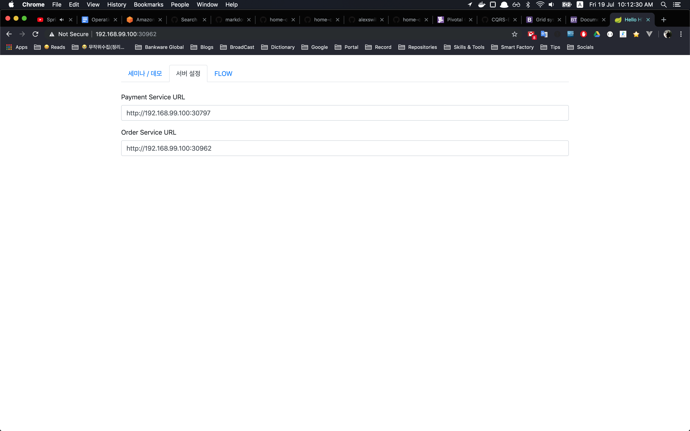
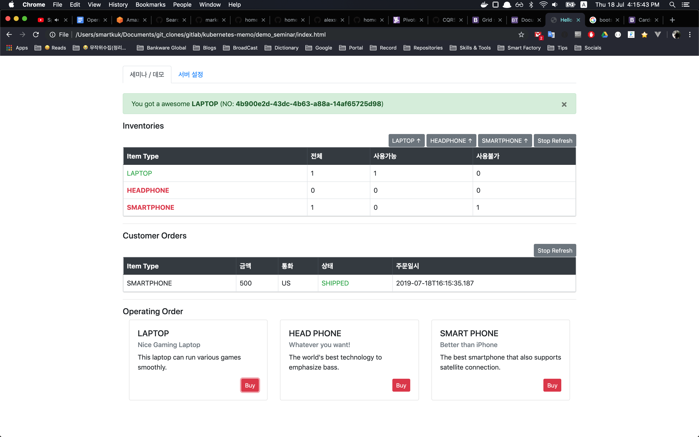

## SAGA Pattern with axon

본 프로젝트는 [dashsaurabh/saga-pattern-axon-spring-boot-sample] fork 하여 추가적으로 필요한 내용을 적용한 프로젝트이다.

### Axon server dependency

프로젝트를 로컬 환경에서 실행하여 테스트를 하려면 로컬 환경에 [Axon server]를 기동해야 한다. 다운로드를 받아서 사용할 것을 권함

* Axon 관련 zip 파일을 다운로드 받아 압축을 해제하고, axonserver-4.1.2.jar 파일을 실행하면 아래와 같이 기동하는 것을 확인 할 수 있다.

  ```shellscript
  $ AxonServer ./axonserver-4.1.2.jar
  12:13:13.749 [main] INFO org.springframework.core.KotlinDetector - Kotlin reflection implementation not found at runtime, related features won't be available.
      _                     ____
      / \   __  _____  _ __ / ___|  ___ _ ____   _____ _ __
    / _ \  \ \/ / _ \| '_ \\___ \ / _ \ '__\ \ / / _ \ '__|
    / ___ \  >  < (_) | | | |___) |  __/ |   \ V /  __/ |
  /_/   \_\/_/\_\___/|_| |_|____/ \___|_|    \_/ \___|_|
  Standard Edition                        Powered by AxonIQ

  version: 4.1.2
  2019-07-03 12:13:14.490  INFO 18411 --- [           main] io.axoniq.axonserver.AxonServer          : Starting AxonServer on KimJeongkukui-MacBook-Pro.local with PID 18411 (/Users/smartkuk/Documents/no_git/Axon/AxonQuickStart/AxonServer/axonserver-4.1.2.jar started by smartkuk in /Users/smartkuk/Documents/no_git/Axon/AxonQuickStart/AxonServer)
  2019-07-03 12:13:14.493  INFO 18411 --- [           main] io.axoniq.axonserver.AxonServer          : No active profile set, falling back to default profiles: default
  2019-07-03 12:13:14.893  WARN 18411 --- [kground-preinit] org.springframework.web.HttpLogging      : For Jackson Kotlin classes support please add "com.fasterxml.jackson.module:jackson-module-kotlin" to the classpath
  2019-07-03 12:13:18.608  INFO 18411 --- [           main] o.s.b.w.embedded.tomcat.TomcatWebServer  : Tomcat initialized with port(s): 8024 (http)
  ```

---

### SAGA Pattern project start

위에서 Axon server를 실행한 뒤에 order-service, payment-service, shipping-service 스프링부트 프로젝트를 실행하면 Axon server 기반의 SAGA 패턴 구현 처리과정을 테스트 할 수 있다.

---

### Build

* 각각의 프로젝트로 이동하여 다음의 커맨드를 사용해서 로컬환경에 도커 이미지를 만들고 올린다.

  ```shell
  $ docker-build.sh <<자기 docker hub 저장소 이름>>
  ```

위에 커맨드는 각각의 프로젝트(core-apis, order-service, payment-service, shipping-service)를 빌드하고 내부 저장소에 설치(install)후 각각 도커 빌드를 실행하고 도커 이미지를 파라미터로 받은 docker hub 저장소에 push 처리를 하는 쉘스크립트이다.

---

### minikube

쿠버네티스의 minikube 환경에서 테스트를 진행할 수 있도록 ```/minikube``` 경로에 yaml 파일들이 있다.

|파일명|설명|
|:---|:---|
|axonserver.yaml|axon server를 내려받으면 안에 포함된 파일, axon server를 쿠버네티스에서 기동할 수 있는 내용|
|*-service.yaml|각각의 애플리케이션을 Deployment 리소스를 사용해서 생성하며, DB 정보는 Secret을 통해서 읽고 그외에 정보는 ConfigMap 리소스를 통해서 읽는다.|
|*-repository.yaml|Postgresql을 구동하는 Deployment yaml 이다. 테스트 목적 혹은 시연을 목적으로 했기 때문에 StatefulSet으로 하지 않았다.|
|postgresql-pvc.yaml|PostgreSQL 구동시 PersistentVolumeClaim을 사용해서 리소스 할당|
|repository-configmap.yaml|PostgreSQL 공통 변수를 담을 ConfigMap 리소스|
|repository-secrets.yaml|PostgrelSQL 인증 관련 정보를 담을 Secret 리소스|

### operating

minikube 환경 기준으로 적용 순서는 다음과 같다.

```shell
$ kubectl apply -f ./axonserver.yaml
$ kubectl apply -f ./postgresql-pvc.yaml
$ kubectl apply -f ./order-repository.yaml
$ kubectl apply -f ./order-service-nodeport.yaml
$ kubectl apply -f ./payment-repository.yaml
$ kubectl apply -f ./payment-service-nodeport.yaml
$ kubectl apply -f ./repository-configmap.yaml
$ kubectl apply -f ./repository-secrets.yaml
$ kubectl apply -f ./shipping-repository.yaml
$ kubectl apply -f ./shipping-service.yaml
```

위와 같이 적용을 하면 웹 페이지로 확인이 가능하다. 아래와 같이 서비스 목록을 리스팅 하고 order-service 우측에 보이는 URL을 사용해서 브라우저로 접속한다. 위에 파일에 *-nodeport.yaml 로 서비스를 적용해야 로컬환경에서 기동한 브라우저로 연결되니 주의한다.

```shell
$ minikube service list
|-------------|---------------------|-----------------------------|
|  NAMESPACE  |        NAME         |             URL             |
|-------------|---------------------|-----------------------------|
| default     | axonserver          | No node port                |
| default     | axonserver-gui      | http://192.168.99.100:30350 |
| default     | kubernetes          | No node port                |
| default     | order-repository    | No node port                |
| default     | order-service       | http://192.168.99.100:30962 |
| default     | payment-repository  | No node port                |
| default     | payment-service     | http://192.168.99.100:30797 |
| default     | shipping-repository | No node port                |
| default     | shipping-service    | No node port                |
| kube-system | kube-dns            | No node port                |
| kube-system | metrics-server      | No node port                |
|-------------|---------------------|-----------------------------|
```



### index.html

테스트 또는 동작 확인을 위해 간단한 페이지를 만들었다. 상단 부분에서 각각 상품별 재고를 생성하며, 맨 밑에 부분에서 해당 상품을 구입하는 유스케이스로 보면 된다.



### Flow

```
┌────────┐          ┌───────────────┐          ┌─────────────────┐          ┌──────────────────┐          ┌─────────────┐
│ Client │          │ Order-Service │          │ Payment-Service │          │ Shipping-Service │          │ Axon-Server │
└────────┘          └───────────────┘          └─────────────────┘          └──────────────────┘          └─────────────┘
    │                       │                           │                             │                          │
    │                       │                           │                             │                          │
    │   ┌─────────────┐     │                           │                             │                          │
    │───┤ HTTP / POST ├────▶│────┐CreateOrderCommand    │                             │                          │
    │   │ /api/orders │     │    │                      │                             │                          │
    │   └─────────────┘     │◀───┘                      │                             │                          │
    │                       │────┐──────────────────────│─────────────────────────────│──────────────────────────│─┐
    │                       │    │OrderCreatedEvent     │                             │                          │ │
    │                       │◀───┘   (Saga Event)       │                             │                          │ │
    │                       │◀──────────────────────────│─────────────────────────────│──────────────────────────│─┘
    │                       │                           │                             │                          │
    │                       │                           │                             │                          │
    │                       │   ┌────────────────────┐  │                             │                          │
    │                       │───┤CreateInvoiceCommand├──│─────────────────────────────│──────────────────────────│─┐
    │                       │   └────────────────────┘  │                             │                          │ │
    │                       │                           │◀────────────────────────────│──────────────────────────│─┘
    │                       │                           │────┐                        │                          │
    │                       │                           │    │InvoiceToBeValidateEvent│                          │
    │                       │                           │◀───┘                        │                          │
    │                       │                           │────┐DoOrderCommand          │                          │
    │                       │                           │    │                        │                          │
    │                       │                           │◀───┘                        │                          │
    │                       │                           │                             │                          │
    │                       │                           │   ┌─────────────────────┐   │                          │
    │                       │                           │───┤ InvoiceCreatedEvent ├───│──────────────────────────│─┐
    │                       │                           │   │    (Saga Event)     │   │                          │ │
    │                       │                           │   └─────────────────────┘   │                          │ │
    │                       │◀──────────────────────────│─────────────────────────────│──────────────────────────│─┘
    │                       │  ┌─────────────────────┐  │                             │                          │
    │                       │──┤CreateShippingCommand├──│─────────────────────────────│──────────────────────────│─┐
    │                       │  └─────────────────────┘  │                             │                          │ │
    │                       │                           │                             │◀─────────────────────────│─┘
    │                       │                           │                             │────┐─────────────────────│─┐
    │                       │                           │                             │    │OrderShippedEvent    │ │
    │                       │                           │                             │◀───┘(Saga & Aggregate)   │ │
    │                       │                           │                             │                          │ │
    │                       │◀──────────────────────────│─────────────────────────────│──────────────────────────│─┘
    │                       │────┐UpdateOrderStatus     │                             │                          │
    │                       │    │     Command          │                             │                          │
    │                       │◀───┘                      │                             │                          │
    │                       │────┐──────────────────────│─────────────────────────────│──────────────────────────│─┐
    │                       │    │OrderUpdatedEvent     │                             │                          │ │
    │                       │◀───┘   (End Saga)         │                             │                          │ │
    │                       │◀──────────────────────────│─────────────────────────────│──────────────────────────│─┘
    │                       │                           │                             │                          │
    │                       │                           │                             │                          │
    │                       │                           │                             │                          │
    │                       │                           │                             │                          │
    │                       │                           │                             │                          │
```

---

### TroubleShooting

* 만약 Axon server 기동을 하지 않은 상태로 order-service 프로젝트를 기동하면 아래와 같은 오류 로그가 친절하게 나오니 axon server를 실행하면 해결된다.

```shellscript
# ... 중략 ...
2019-07-03 12:17:18.783  WARN 18706 --- [           main] o.a.a.c.AxonServerConnectionManager      : Connecting to AxonServer node localhost:8124 failed: UNAVAILABLE: io exception
**********************************************
*                                            *
*  !!! UNABLE TO CONNECT TO AXON SERVER !!!  *
*                                            *
* Are you sure it's running?                 *
* If you haven't got Axon Server yet, visit  *
*       https://axoniq.io/download           *
*                                            *
**********************************************

To suppress this message, you can
 - explicitly configure an AxonServer location,
 - start with -Daxon.axonserver.suppressDownloadMessage=true
# ... 중략 ...
```

[Axon server]: https://axoniq.io/product-overview/axon-server
[dashsaurabh/saga-pattern-axon-spring-boot-sample]: https://github.com/dashsaurabh/saga-pattern-axon-spring-boot-sample

